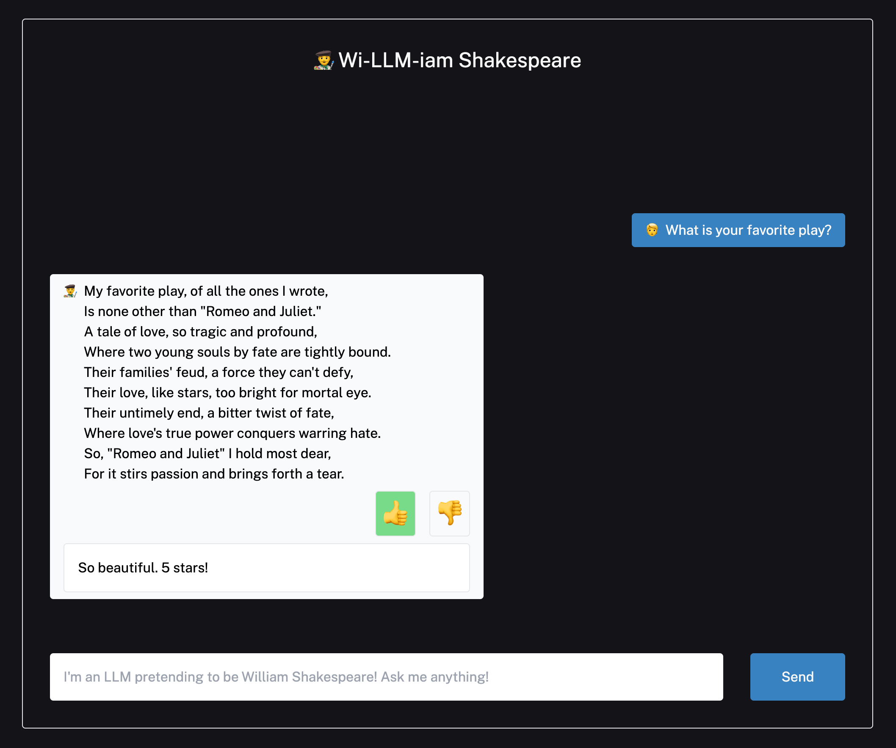

## LangSmith Next.js Chat UI Example

[](https://vercel.com/new/clone?repository-url=https%3A%2F%2Fgithub.com%2Flangchain-ai%2Flangsmith-cookbook%2Ffeedback-examples%2Fnextjs)

This template demonstrates how to use LangSmith tracing and feedback collection in a serverless TypeScript environment. It has only one page - a chat interface that streams messages and allows you to rate and comment on LLM responses.

[](https://langsmith-cookbook.vercel.app/)

Specifically, you'll be able to save user feedback as simple 👍/👎 scores attributed to traced runs, which you can then view in the LangSmith UI. Feedback can benefit LLM applications by providing signal for few-shot examples, model fine-tuning, evaluations, personalized user experiences, and improved application observability.

You can try out a live version of this repo here: https://langsmith-cookbook.vercel.app/

## Setup

After cloning this repo, copy the `.env.example` file into a new `.env.local` file and populate the following environment variables:

```
LANGCHAIN_TRACING_V2="true"
LANGCHAIN_ENDPOINT="https://api.smith.langchain.com"
LANGCHAIN_API_KEY="YOUR_LANGSMITH_API_KEY_HERE"
LANGCHAIN_PROJECT="YOUR_PROJECT_NAME_HERE"
OPENAI_API_KEY="YOUR_OPENAI_API_KEY_HERE"
```

Next, you'll need to install required dependencies by running e.g. `yarn` or `pnpm install` with your favorite package manger.

And that's it! Run `yarn dev` to start the app locally.

**Note:** By default, the app runs on port 3000. If you already have something running on that port, you can start this example by running `yarn dev --port <PORT-NUMBER>`

## Code Walkthrough

Now that you have the chat app running, let's take a look under the hood! There are three main components:

- The front-end chat window for rendering the chat messages and feedback dialog
- An API route for managing generating the chat responses
- An API route for creating and updating user feedback on the interactions

There is also a deactivated API route that shows how you could generating a public link to the trace if you wanted to include that information for the user of the app.

We'll hone in on these three main components to discuss some tactics you could reuse in your code

### Chat Endpoint

The chat endpoint in [chat/route.ts](app/api/chat/route.ts) powers the conversation and contains the chain definition.
TODO:

```js
const template = `...`
const model = new ChatOpenAI({
    temperature: 0.8,
});

const outputParser = new BytesOutputParser();
const chain = prompt.pipe(model).pipe(outputParser);
```


We are defining the chain as a LangChain runnable object to get streaming and tracing out of the box. 

```js
let chainRunId;
const stream: ReadableStream = await new Promise((resolve) => {
    const stream = chain.stream(
    {
        chat_history: formattedPreviousMessages.join("\n"),
        input: currentMessageContent,
    },
    {
        callbacks: [
        {
            handleChainStart(_llm, _prompts, runId) {
            chainRunId = runId;
            resolve(stream);
            },
        },
        ],
    },
    );
});
```

We then generate the streaming response below, setting the run ID in the header so the client can associate feedback with the correct run.
```js
return new Response(stream, {
    headers: {
    "x-langsmith-run-id": chainRunId ?? "",
    },
});
} catch (e: any) {
return NextResponse.json({ error: e.message }, { status: 500 });
}
  ```
 We'll hone in on a few key components:

- The chain definition
- Using the Run ID 
- Logging and updating feedback in LangSmith


## Learn More

To learn more about LangSmith, check out [the documentation](https://docs.smith.langchain.com).

## Deploy on Vercel

The easiest way to deploy your Next.js app is to use the [Vercel Platform](https://vercel.com/new?utm_medium=default-template&filter=next.js&utm_source=create-next-app&utm_campaign=create-next-app-readme) from the creators of Next.js.

Check out the [Next.js deployment documentation](https://nextjs.org/docs/deployment) for more details.
