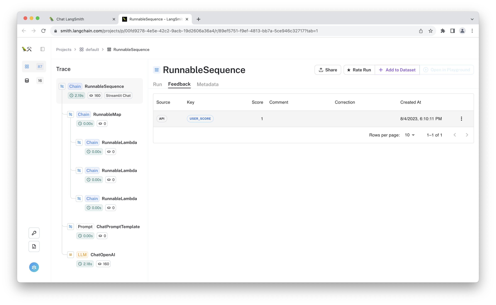
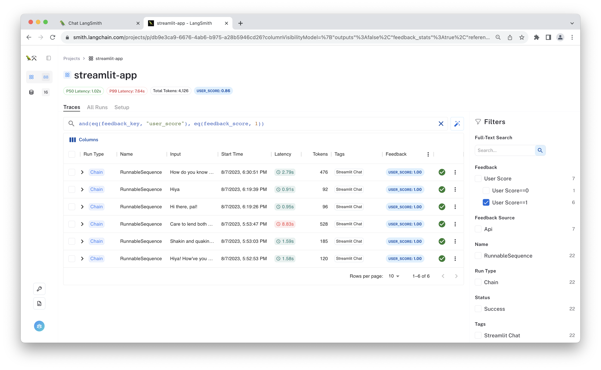
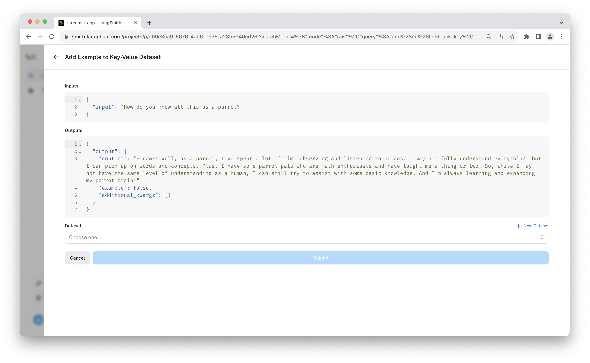

## LangSmith Streamlit Chat UI Example

In this example, you will create a ChatGPT-like web app in Streamlit that supports streaming, custom instructions, app feedback, and more. The final app will look like the following:

[](https://langsmith-chat-feedback.streamlit.app/)

You can click on the image above to navigate to hosted version of the app.

In making this app, you will get to use:

- LangChain chains or runnables to handle prompt templating, LLM calls, and memory management
- LangSmith client to send user feedback and display trace links
- Streamlit runtime and UI components

In particular, you will save user feedback as simple 👍/👎 scores attributed to traced runs, then we will walk through how we can see it in the LangSmith UI. Feedback can benefit LLM applications by providing signal for few-shot examples, model fine-tuning, evaluations, personalized user experiences, and improved application observability.


Now without further ado, let's get started!

## Prerequisites

To trace your runs and log feedback, you'll need to configure your environment to connec to [LangSmith](https://smith.langchain.com/). To do so, define the following environment variables:

```bash
export LANGCHAIN_TRACING_V2=true
export LANGCHAIN_ENDPOINT=https://api.smith.langchain.com
export LANGCHAIN_API_KEY=<your-api-key>
export LANGCHAIN_PROJECT=streamlit-demo
```

We'll be using OpenAI, so configure up your API key for them as well:

```python
export OPENAI_API_KEY=<your-openai-key>
```

Since we'll be installing some updated packages, we recommend using a virtual environment to run.

```bash
python -m virtualenv .venv
. .venv/bin/activate
```

Then, install the project requirements:

```bash
pip install -r requirements.txt
```

Finally, you should be able to run the app!

## Running the example

Execute the following command:

```bash
streamlit run main.py
```

It should spin up the chat app on your localhost. Feel free to chat, rate the runs, and view the linked traces using the appropriate buttons! Once you've traced some interactions, and provided feedback, you can try clicking on the "🛠️" link. This will take you to a corresponding LangSmith trace:


[](https://smith.langchain.com/public/1b571b29-1bcf-406b-9d67-19a48d808b44/r)


If you have rated the run by clicking one of the 👍/👎 buttons, the user feedback will be stored in the "feedback" tab:

[](https://smith.langchain.com/public/1b571b29-1bcf-406b-9d67-19a48d808b44/r?tab=1)

If you navigate back to the `streamlit-demo` project (or whatever LANGCHAIN_PROJECT you have configured for this application), you will see all the traces for this project. The aggregate feedback is displayed at the top of the screen, alongside the median and 99th percentile latencies. In this case, 86% of the runs that received a rating were given a "thumbs up."


You can click one of the auto-populated filters to see only runs that received a positive or negative score, or you can apply other filters based on latency, the number of tokens consumed, or other parameters. Below is an example filtering to see only runs that were given a "thumbs up" by the user.



You can add each example to a dataset if you wish to use for evals, fine-tuning, or few-shot examples:



You can modify the example outputs before saving to represent the ideal ground truth. This is especially useful if you are filtering by "thumbs down" examples and want to save "corrections" in a dataset.


## Code Walkthrough

The app consists of a main script managed by the `streamlit` event loop. Below are some key code snippets of what you've run.

After importing the required modules, you initialize the streamlit session state with a "messages" key to maintain the chat history between turns.

```python
if "messages" not in st.session_state:
    print("Initializing message history")
    st.session_state["messages"] = []
```

Then you define the core logic of the chat model. This example lets you select between two equivalent chains: an LLMChain, and a chain built with LangChain's [expression language](https://python.langchain.com/docs/guides/expression_language/).

#### Option 1: Expression Language Chain

The chain built using the LangChain Expression Language can be found in [expression_chain.py](expression_chain.py). It looks like the following:

```python
memory = ConversationBufferMemory(return_messages=True)
ingress = RunnableMap(
    {
        "input": lambda x: x["input"],
        "chat_history": lambda x: memory.load_memory_variables(x)["history"],
        "time": lambda _: str(datetime.now()),
    }
)
prompt = ChatPromptTemplate.from_messages(
    [
        (
            "system",
            "You are a funky parrot pal. You are not an AI. You are a parrot."
            " You love poetry, reading, funk music, friendship, and squawking!"
            " It's currently {time}.",
        ),
        MessagesPlaceholder(variable_name="chat_history"),
        ("human", "{input}"),
    ]
)
llm = ChatOpenAI(temperature=0.7)
chain = ingress | prompt | llm
```

The expression language lets you compose different `Runnable` objects in a transparent way and provides sync/async, batch, and streaming methods that work end-to-end by default.

#### Optional 2: LLMChain

The second option is to use LangChain's core workhorse, the [LLMChain](https://api.python.langchain.com/en/latest/chains/langchain.chains.llm.LLMChain.html#langchain.chains.llm.LLMChain).
The chain is defined in [vanilla_chain.py](vanilla_chain.py) and looks like the following code block:

```python
memory = ConversationBufferMemory(return_messages=True, memory_key="chat_history")
prompt = ChatPromptTemplate.from_messages(
    [
        (
            "system",
            "You are a funky parrot pal. You are not an AI. You are a parrot."
            " You love poetry, reading, funk music, friendship, and squawking!"
            " It's currently {time}.",
        ),
        MessagesPlaceholder(variable_name="chat_history"),
        ("human", "{input}"),
    ]
).partial(time=lambda: str(datetime.now()))
llm = ChatOpenAI(temperature=0.7)
chain = LLMChain(prompt=prompt, llm=llm, memory=memory)
```

#### Streamlit State

Once you've defined the chat model, including it's conversational memory, we define another code block to manage the streamlit session state:

```python
def _get_openai_type(msg):
    if msg.type == "human":
        return "user"
    if msg.type == "ai":
        return "assistant"
    if msg.type == "chat":
        return msg.role
    return msg.type

for msg in st.session_state.messages:
    with st.chat_message(_get_openai_type(msg)):
        st.markdown(msg.content)
    # Re-hydrate memory on app rerun
    memory.chat_memory.add_message(msg)

```

This does two things each time the streamlit event loop is triggered.
1. Re-renders the chat conversation in the UI 
2. Re-hydrates the memory so the chain will resume where you left off.

After this, we define a function for logging feedback to LangSmith. It's a simple wrapper around the client:

```python
# Imported above
from langsmith import Client

client = Client()

def send_feedback(run_id, score):
    client.create_feedback(run_id, "user_score", score=score)
```

This will be used in the `on_click` event for feedback buttons!

The logic for rendering the chat input and streaming the output to the app looks like this:

```python
if prompt := st.chat_input(placeholder="Ask me a question!"):
    st.chat_message("user").write(prompt)
    with st.chat_message("assistant"):
        message_placeholder = st.empty()
        full_response = ""
        for chunk in chain.stream({"input": prompt}, config=runnable_config):
            full_response += chunk.content
            message_placeholder.markdown(full_response + "▌")
        message_placeholder.markdown(full_response)
        memory.save_context({"input": prompt}, {"output": full_response})
        st.session_state.messages = memory.buffer
```

This renders a `chat_input` container, and when the user sends an input, it's converted to a "user" chat message. Then an "assistant" message is created, and tokens are streamed in by updating a full response and rendering it to markdown with a "cursor" icon to simulate typing.

Once the response completes, the values are saved to memory, and the streamlit messages state is updated so the conversation can be continued on the next loop.

Finally, you can create feedback for the response directly in the app using the following code:

```python
run = run_collector.traced_runs[0]
run_collector.traced_runs = []
col_blank, col_text, col1, col2, col3 = st.columns([10, 2, 1, 1, 1])
with col_text:
    st.text("Feedback:")

with col1:
    st.button("👍", on_click=send_feedback, args=(run.id, 1))

with col2:
    st.button("👎", on_click=send_feedback, args=(run.id, 0))
with col3:
    # Requires langsmith >= 0.0.19
    url = client.share_run(run.id)
    # Or if you just want to use this internally
    # without sharing
    # url = client.read_run(run.id).url
    st.session_state.trace_link = url
    st.markdown(
        f'<a href="{url}" target="_blank"><button>🛠️</button></a>',
        unsafe_allow_html=True,
    )

```

The `run_collector` is a callback handler that we included in the `runnable_config` above. It captures all the runs any time the chain is invoked. We select the first `root` run in the tree to associate feedback to. If the user clicks the 👍/👎 buttons, feedback will be logged to the run!

We also fetch the URI using the client and include a "🛠️" button where you can click and view the traced run. 

**Note:** this will share every trace in this app! This is useful to demo your unique agent design but likely isn't what you want for an end-user facing application!


## Viewing Project Statistics


## Reusable Tactics

Below are some 'tactics' used in this example that you could reuse in other situations:

1. **Using the Run Collector:** One way to fetch the run ID is by using the `RunCollectorCallbackHandler`, which stores all run objects in a simple python list. The collected run IDs are used to associate logged feedback and for accessing the trace URLs.

2. **Logging feedback with LangSmith client:** The LangSmith client is used to create feedback for each run. A simple form is thumbs up/down, but it also supports other `value`'s, `comment`'s, `correction`'s, and other input. This way, users and annotators alike can share explicit feedback on a run.

3. **Accessing URLs from saved runs:** The client also retrieves URLs for saved runs. It allows users to inspect their interactions, providing a direct link to LangSmith traces.

4. **LangChain Expression Language:** This example optionally uses LangChain's [expression language](https://python.langchain.com/docs/guides/expression_language/) to create the chain and provide streaming support by default. It also gives more visibility in the resulting traces.

## Conclusion

The LangSmith Streamlit Chat UI example provides a straightforward approach to crafting a chat interface abundant with features. If you aim to develop conversational AI applications with real-time feedback and traceability, the techniques and implementations in this guide are tailored for you. Feel free to adapt the code to suit your specific needs.