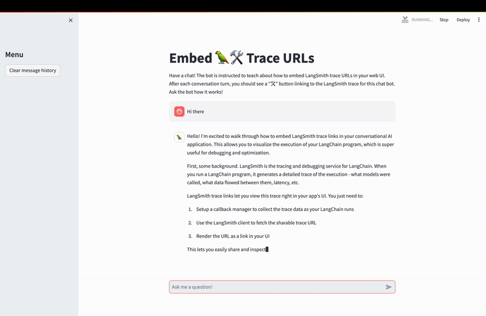

# Embedding Trace Links

Debugging LLM apps and agents is difficult. When a bot gives a wrong response, it can be hard to identify the root cause.

Full traceability lets us inspect the data flow through component. With visibility into execution flow, we can identify and fix failure points.

In this tutorial, you'll surface the URL of a trace within your Streamlit chatbot by:

- Capturing full traces with LangSmith 
- Using the client to resolve the trace URL
- Displaying trace URLs in the UI

This makes it easy to debug your chain or agent, since you can directly interact with the UX your users will face and quickly check traces when the performance is underwhelming. The demo app will look like this:



## Key Code Snppet

The primary code snippet you can incorporate for your development is as follows:


```python
from langchain import callbacks
import langsmith

client = langsmith.Client()

# .. define chain ...
with callbacks.collect_runs() as cb:
    for tok in chain.stream({"input": "<user-input>"}):
        print(tok, end="",flush=True)
    url = client.read_run(cb.traced_runs[0].id).url
    print(url)
```

The `collect_runs()` context manager collects the trace as an in-memory run object. Then the LangSmith client fetches the URL of stored trace for easy visibility. Activating this functionality while working in your dev environment allows you to conveniently visit the trace from your UI without having to search through other logs.

Having provided the main focus, let's see how it fits in with the whole demo app!

## Requirements

First, let's set up by creating a virtual Python environment, activating it, installing requirements, and setting up the key:

```
python -m virtualenv .venv
source .venv/bin/activate
pip install -r requirements.txt 

# Set API key
export LANGCHAIN_API_KEY=...
```

After setup is done, run the application:

```python
ENVIRONMENT=dev python -m streamlit run app.py
```

## Chat Bot Overview

### Memory

To track state across turns, a `ConversationBufferMemory` is used:

```python
memory = ConversationBufferMemory(
    chat_memory=StreamlitChatMessageHistory(key="chat_history"),
    memory_key="chat_history"  
)
```

This small utility bridges the chat log with the Streamlit session state.

### Prompt

We define a `ChatPromptTemplate` to format context, question, and instructions:

```python
prompt = ChatPromptTemplate(
    [("system", INSTRUCTIONS),
     MessagesPlaceholder("chat_history"),
     ("human", "{input}")]
)
```

Where `INSTRUCTIONS` defines the conversational task.

### LLM Chain 

Our chain composes the prompt, model, and memory:

```python 
chain = (
    # dict <- (runnables)
    runnable.RunnableMap(
        {
            "input": operator.itemgetter("input"),
            "chat_history": lambda x: chain_memory.load_memory_variables(x)[
                "chat_history"
            ],
        }
    )
    | prompt
    # You can use another model provider, such as Openai, LlamaCPP, etc.
    | chat_models.ChatAnthropic(model="claude-2", temperature=1)
)
```

### Tracing

We wrap execution in `collect_runs` to capture traces:

```python
with collect_runs() as collector:
   response = chain(input=question)
   
   run_id = collector.runs[0].id
```

This captures the full trace locally in memory. We will use this to return the run ID.

### Fetching URLs

We use the LangSmith client to get the URL for a run ID:

```python
client = LangSmithClient()
url = client.read_run(run_id).url 
```

### UI Integration

Finally, we display the link in the sidebar:

```python
st.sidebar.markdown(f"""
[Trace Link]({url}) 
""")
```

Letting you inspect and experiment with the trace if you want to see how different prompt templates or different models would respond.

## Conclusion

This completes the tutorial! Displaying URLs inline is an easy way to avoid having to search through your project to replay or analyze a run. 
